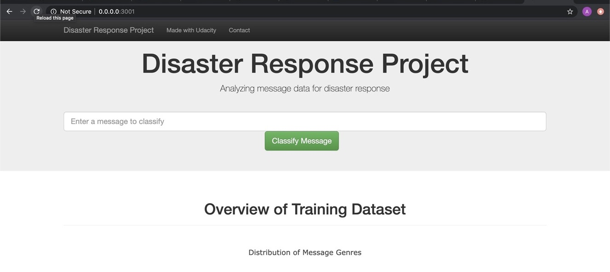
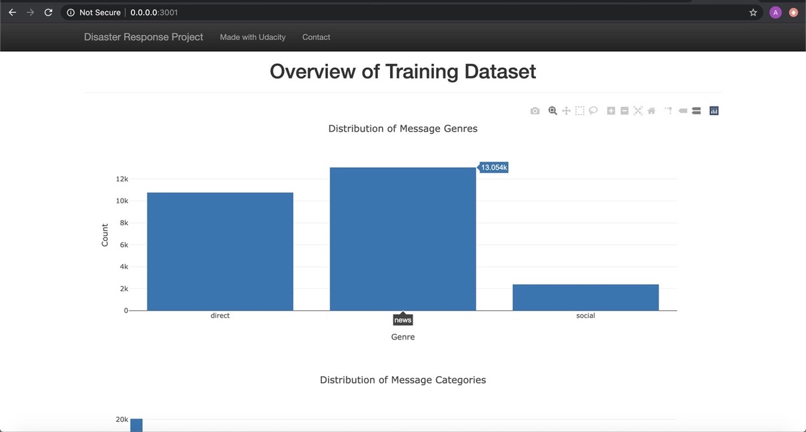
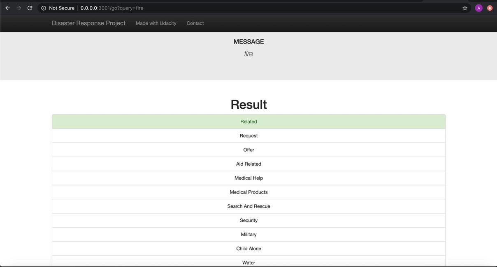
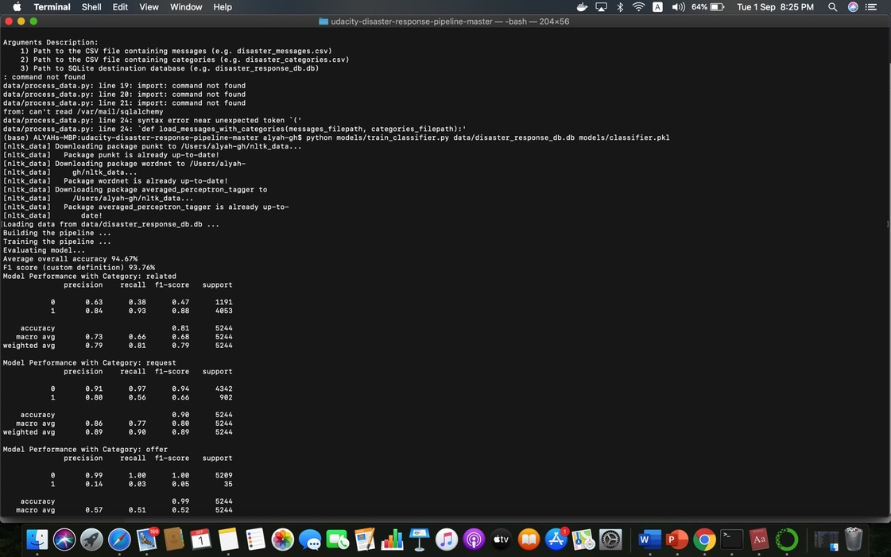

# Disaster-Response-Pipelines

## Required libraries
- nltk 3.3.0
- numpy 1.15.2
- pandas 0.23.4
- scikit-learn 0.20.0
- sqlalchemy 1.2.12

## Installing

To clone the git repository:
https://github.com/alyahali/Udacity_disaster_response_project.git

## Motivation

This Project is part of Data Science Nanodegree Program by Udacity in collaboration with Figure Eight. The dataset contains pre-labelled tweet and messages from real-life disaster events. The project aim is to build a Natural Language Processing (NLP) model to categorize messages on a real time basis.

This project is divided in the following key sections:

Processing data, building an ETL pipeline to extract data from source, clean the data and save them in a SQLite DB
Build a machine learning pipeline to train the which can classify text message in various categories
Run a web app which can show model results in real time

Below are a few screenshots of the web app and others under asset folder

## Files

- data/ETL Preparation Notebook: learn everything about the implemented ETL pipeline
- model/ML Pipeline Preparation Notebook: look at the Machine Learning Pipeline developed with NLTK and Scikit-Learn
- model/train_classifier.py: A machine learning pipeline that:
  - Loads data from the SQLite database
  - Splits the dataset into training and test sets
  - Builds a text processing and machine learning pipeline
  - Trains and tunes a model using GridSearchCV
  - Outputs results on the test set
  - Exports the final model as a pickle file
  
 ### Instructions:
1. Run the following commands in the project's root directory to set up your database and model.

    - To run ETL pipeline that cleans data and stores in database
        ` python data/process_data.py data/disaster_messages.csv data/disaster_categories.csv data/disaster_response_db.db`
    - To run ML pipeline that trains classifier and saves
        `ppython models/train_classifier.py data/disaster_response_db.db models/classifier.pkl`

2. Run the following command in the app's directory to run your web app.
    `python run.py`

3. Go to http://0.0.0.0:3001/

## Acknowledgements

I wish to thank [Figure Eight](https://www.figure-eight.com/) for dataset, thanks for [GitHub](https://github.com/) for examples, and thank [Udacity](https://www.udacity.com/) for 
advice and review.
